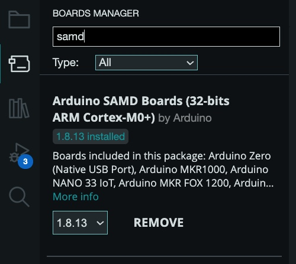

# Lorawan-Packet-Test

This repo shows the results and assets used when conducting a test to get a general idea
of signal and packet size range of our rpi.lorawan compute

## Table of Contents
1. [Repo Structure](#repo-structure)
1. [Test Set up](#test-set-up)
1. [Lorawan Test Device (Arduino)](#lorawan-test-device-arduino)
1. [rpi.lorawan Compute](#rpilorawan-compute)

## Repo Structure
 - **[data](./data/)**: raw and processed data that was generated using get.py
 - **[html](./html/)**: includes the folium map with the device and gateway locations with the results.
 - **[images](./images/)**: images used for markdown files.
 - **[src](./src/)**: the source code for the lorawan test device.
    - **[main](./src/main/)**: includes the main code for the device.
    - **[setup](./src/setup/)**: this code is used to setup the device before flashing the main code.
    - **[codec.js](./src/codec.js)**: The decoder for the device.

## Test Set up

The following was conducted and used for the test.

### Items
* Laptop
* Google Maps App
* Lorawan test device (Arduino) programmed with our software and with a battery (or connected to laptop)
* A [Wild Sage Node](https://sagecontinuum.org/docs/about/architecture#wild-sage-node-wild-waggle-node) with a rpi.lorawan module installed and [lorawan software stack](https://sagecontinuum.org/docs/about/architecture#lorawan) running
    - This test can be conducted without a Sage node as long as you have chirpstack running with persistent storage.
    - NOTE: this test is geared to work with SAGE so it will be oriented to use the tools SAGE provides. Although the results aren't impacted by SAGE, so if SAGE is not used the results should be the same.
* [Sage Portal](https://portal.sagecontinuum.org/nodes)

### Steps

1. Write down a description of the environment
    - A basic description of the weather and scene will suffice
1. Write down the gps cords of the gateway
    - Google Maps How to: https://www.wikihow.com/Get-Current-Location-on-Google-Maps
1. Drive/Walk to a location 
1. Mark your gps cords using Google Maps
1. Start the lorawan test using the lorawan test device (Arduino) by clicking the reset button
    * Wait until all packet are sent. Each packet size and data rate combination will send three times
    * The packets will go up to 64 bytes
1. Drive to the next location
    * Start closer to the gateway and then go farther
1. Repeat first 6 steps until you have reached the point where the device can't join anymore.
    - This can either be range or object blockage issues
1. Process your raw data and map the points.

### Results

See [results.ipynb](./results.ipynb) for the test results. The stream of the raw data can be seen [here](https://portal.sagecontinuum.org/query-browser/?apps=.*lorawan-listener%3A0.0.17&nodes=W027&start=2025-04-21T16%3A57%3A08.116Z&page=0&chart=%28type%3Atimeseries%2CshowLines%3Atrue%2CshowPoints%3Afalse%29&end=2025-04-24T16%3A57%3A08.116Z).

## Lorawan Test Device (Arduino)

### 🛠️ Device Overview

This device is designed to test connectivity to a LoRaWAN network and continuously send packets at regular intervals. It features:
- **LoRaWAN communication via OTAA**
- **Visual feedback** using an OLED screen or built-in LED
- **Automatic fallback** to LED indicators when OLED is not detected

### ⚙️ Hardware Requirements
- LoRa-enabled microcontroller (e.g., Arduino MKR WAN 1310)
- 128x32 OLED Display (I2C, address: `0x3C`) – optional
- LoRaWAN Gateway (registered with Chirpstack)
- Device keys (App EUI, App Key)

### Assembling The Device

### Installing Software

1. To connect to the `MKR WAN 1310` board, you will need to install the [Arduino IDE](https://support.arduino.cc/hc/en-us/articles/360019833020-Download-and-install-Arduino-IDE)
1. Once you installed the IDE, you need to further install the board's software support by following the [SAMD21 core for MKR boards Documentation](https://docs.arduino.cc/software/ide-v1/tutorials/getting-started/cores/arduino-samd)

   
1. You will also need the library for mkrwan. Under Library Manager, look up "mkrwan" and install `MKRWAN by Arduino`.

   
    
    >NOTE: At the time of configuring the board `MKRWAN_v2` was not used because of bug issues related to the library.

1. Two Arduino libraries must be installed to start using the display. The SSD1306 driver library is used to initialize the display and provide low level display functions. The GFX library provides graphics functions for displaying text, drawing lines and circles, etc. Both these libraries are available from Adafruit.

    > NOTE: if these two libraries are not found in the library manager, you can also follow this [tutorial](https://startingelectronics.org/tutorials/arduino/modules/OLED-128x64-I2C-display/) 

1. Install the SSD1306 Driver Library. Under Library Manager, look up "Adafruit SSD1306" and install `Adafruit SSD1306 by Adafruit`.

   

1. Install the GFX Library. Under Library Manager, look up "adafruit gfx library" and install `Adafruit GFX Library by Adafruit`.

   

1. An additional library must be installed to get "i2c header", look up "Adafruit BusIO library" and install `Adafruit BusIO by Adafruit`.

   

### Connect MKR WAN 1310 to Computer

1. Connect the board to your computer with the Micro USB wire
   - You should see a green light glow on the board

1. Go to Tools in Arduino IDE and select `Board` then select `Arduino SAMD Boards (32-bits ARM Cortex-M0+)` for the type of board. Finally select `Arduino MKR WAN 1310` for the board as shown: 

    

1. Then select the correct serial port for the arduino as shown:

    

    >NOTE: If Arduino MKR WAN 1310 is not showing up, pressing the "RST" (reset) button twice in quick succession will put the board in bootloader mode. Instead of running a sketch the Arduino will wait until a sketch is uploaded helping the board to show up in your Arduino IDE. 

### Getting your DevEUI

1. Retrieve your MKR WAN 1310's DevEUI by using `setup.ino` in your `Arduino IDE`. The serial monitor will display your DevEUI. When you run `setup.ino` you should see a orange light glow on the board

    

### Adding your Device to a Network Server

1. Using the LoRaWAN Network Server’s portal or API, add your device with the option to use `OTAA` set to yes.

1. Once you've added your device, generate an application key.

1. Provide the application key to `arduino_secrets.h`

1. For your Network Server to decript the uplink packets, use its portal or API to provide the codec: `codec.js`.

### Testing Device Using Chirpstack

[Chirpstack](https://www.chirpstack.io/) was used as our Network Server and a `RAK Discover Kit 2` was used as our Gateway.

1. Retrieve your MKR WAN 1310's DevEUI by using `setup.ino` in your `Arduino IDE`.

    

1. Using Chirpstack's UI, add your device using `OTAA` following [Chirpstack's Documentation](https://www.chirpstack.io/docs/guides/connect-device.html)

1. Once you've added your device, generate an application key or create one via the 'OTAA Keys' tab.

    

1. Provide the application key to `arduino_secrets.h`

    >NOTE: Chripstack does not use `APP EUI` when connecting devices via `OTAA` so this can be left as is.

1. Run `main.ino` in your `Arduino IDE`, if the device connects successfully the LED screen will display a checkmark (follow visual feedback table on what blinks and symbols on LED screen mean)

1. Finally for chirpstack to decript the uplink packets, provide the `codec.js` via the Device Profile's Codec tab.

    

Viewing the uplink packets by clicking `up` in the device's events tab will now display the measurements and its values.

 

### 💡 Visual Feedback

| Event         | OLED Display                  | LED Behavior              |
|---------------|-------------------------------|---------------------------|
| Startup       | "Starting Test..." + scroll   | LED on for 2s             |
| Join Success  | Checkmark + "Join Pass"       | 5 fast blinks             |
| Join Fail     | X mark + "Join Fail"          | 5 slow blinks             |
| Packet Sent   | Checkmark + "Packet Sent"     | 5 fast blinks             |
| Packet Fail   | X mark + "Packet Fail"        | 5 slow blinks             |
| Wait Period   | Snake animation               | Slow blinking LED         |

### 🔁 How to Restart the Device

To restart the test cycle:
- Simply **reset (RST button on board) or power-cycle** the device.
- It will reattempt to join and start the test.

## rpi.lorawan Compute

rpi.lorawan consist of a rasberry pi with a pi hat connected to a rak wireless concentrator. The antenna we used was 5.8dBi Fiberglass Antenna from RAK. Below are the links to the related hardware:
- [rpi.lorawan Compute](https://store.rakwireless.com/products/rak-discover-kit-2?variant=39942870302918)
    - frequency: US915
    - version: 4GB RPI4
- [Lorawan Antenna](https://store.rakwireless.com/products/5-8dbi-fiber-glass-antenna?variant=41100723912902)
    - Gain: 5.8 dBi 
    - frequency: 902-928MHz
    - connector type: iPEX

The rpi.lorawan was flashed with [waggle-rpi image](https://github.com/waggle-sensor/waggle-rpi-sd-flash/releases/tag/v2.0.0) but the image does not really matter as long as chirpstack is running with persistent storage. Again, since we are using SAGE the rpi needed to be flashed with this image so it can connect to the SAGE infrastructure.

### Hardware

The rest of the hardware in [bill of materials](./BOM.csv) for rpi.lorawan is the wiring. The rpi base, box, and metal plate were purposely left out as this does not affect the test in any way and can be replaced with your choosing. The following is an image of the rpi.lorawan compute with its wiring.

